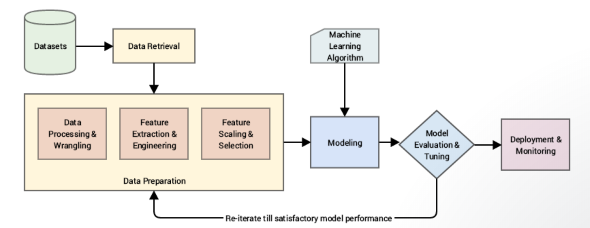
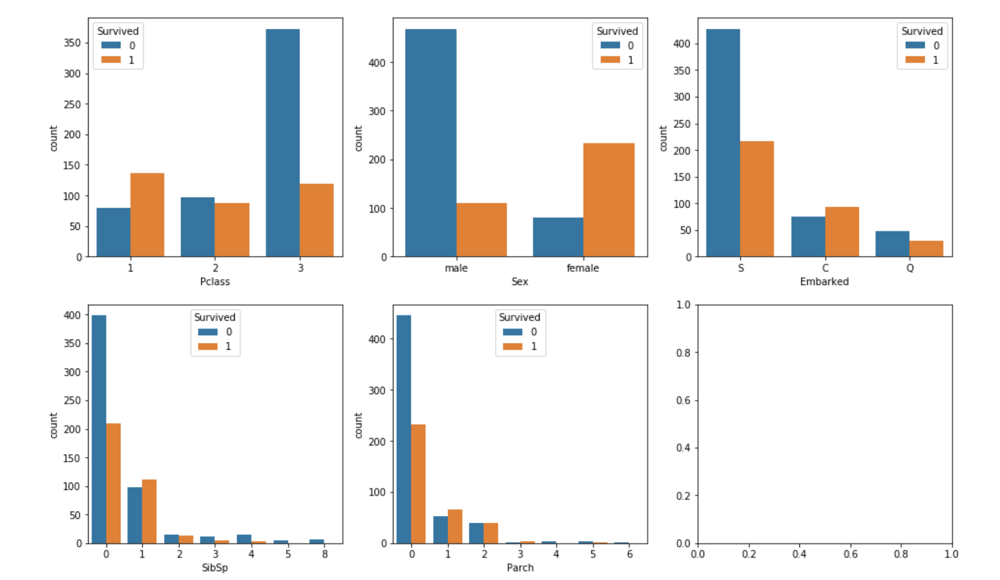
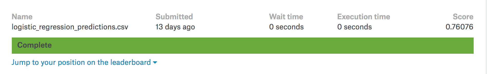

# Titanic _ Surivive _ Prediction
## Content
1. WorkFlow
2. Feature Engineering
3. Data Pre-process
4. Modeling

## 1. WorkFlow
`
_This workflow picture shows the steps of my project._
## 2. Feature Engineering 
### 2.1 Data Dictionary

|Variable|Definition|Key|
|:------:|:--------:|:-:|
|survival|Survival|0 = No, 1 = Yes|
|pclass|Ticket class| 1= 1st, 2=2nd, 3=3rd|
|sex|Sex||
|sib sp|# of siblings/spouses aboard the Titanic|
|parch|# of parents/children aboard the Titanic|
|ticket|Ticket number||
|fare|Passenger fare||
|cabin|Cabin number||
|embarked|Port of Embarkation|C = Cherbourg, Q = Queenstown, S = Southampton||

### 2.2 Improt dataset and package
 * `import numpy as np`  
 * `import pandas as pd`  
 
 * `data_train = pd.read_csv('train.csv')`  

_Feature Engineering proecess is an important process.  I learned from other contributors' kernels and conclude the main features as follows:_

* `import matplotlib.pyplot as plt`
* `import seaborn as sns`

`f,ax = plt.subplots(2,3,figsize=(16,10))`  
`sns.countplot('Pclass',hue='Survived',data=data_train,ax=ax[0,0])`
`sns.countplot('Sex',hue='Survived',data=data_train,ax=ax[0,1])`
`sns.countplot('Embarked',hue='Survived',data=data_train,ax=ax[0,2])`
`sns.countplot('SibSp',hue='Survived',data=data_train,ax=ax[1,0])`
`sns.countplot('Parch',hue='Survived',data=data_train,ax=ax[1,1])`

`

_From the plot, some guesses can be done as follows:_  
1. the Pclass picture shows the first class people have a high rate to survive  
2. the Sex picture shows Female has a high possibility to survive compared with male  
3. the Embarked picture shows Cherbourg port has a high rate to survive, and most people died on Southampton  
4. The Sibsp and Parch picture show the relationship of people may affect the survive rate
## 3. Data Pre-processing
* `from sklearn.ensemble import RandomForestRegressor`
* `import sklearn.preprocessing as preprocessing`
* `from sklearn import linear_model`
  
### 3.1 Missing Values
* Total: 891
* Age: 714 
* Cabin: 204  

_Cabin has to many missing values more than 3/4 so I decide to drop this attribute._  
_Age has 177 missing values so next step I am going to predict the missing values._  
`def  set_missing_valuesset_mis (data):`  
>`age_df=data[['Age','Fare','Parch','SibSp','Pclass']]`    
`know_age = age_df[data.Age.notnull()].values`  
`unknow_age = age_df[data.Age.isnull()].values`  
`X = know_age[:,1:]`    
`y = know_age[:,0]`  
`rfr=RandomForestRegressor(random_state=0,n_estimators=2000,n_jobs=-1)`  
`rfr.fit(X,y)`  
`PredictAges = rfr.predict(unknow_age[:,1:])`  
`data.loc[(data.Age.isnull()),'Age'] = PredictAges`  
`data.drop(['Cabin'], axis=1, inplace = True)`  
`return data, rfr`  

`data_train, rfr = set_missing_values(data_train)`  
### 3.2 Binarize categorical feature
`def attribute_to_number(data):`  
>`dummies_Pclass = pd.get_dummies(data['Pclass'], prefix='Pclass')`  
`dummies_Sex = pd.get_dummies(data['Sex'], prefix='Sex')`  
`dummies_Embarked = pd.get_dummies(data['Embarked'], prefix='Embarked')`  
`data = pd.concat([data,dummies_Pclass,dummies_Sex,dummies_Embarked],axis=1)`  
`data.drop(['Pclass','Sex','Embarked'], axis=1, inplace=True)`  
`return data` 

`data_train_number = attribute_to_number(data_train)`
### 3.3 Scale feature
Age, Fare have large value change so i will normalize these values to (-1,1)  

`def Scales(data):`    
>`scaler = preprocessing.StandardScaler()`    
`age_scale_param = scaler.fit(data['Age'].values.reshape(-1, 1))`  
`data['Age_scaled'] = scaler.fit_transform(data['Age'].values.reshape(-1, 1), age_scale_param)`  
`fare_scale_param = scaler.fit(data['Fare'].values.reshape(-1, 1))`  
`data['Fare_scaled'] = scaler.fit_transform(data['Fare'].values.reshape(-1, 1), fare_scale_param)`  
`data.drop(['Fare', 'Age'], axis=1, inplace=True)`  
`return data`  

`data_train_number_scales = Scales(data_train_number)`  
## 4. Modeling
### 4.1 Get X and y
`data_train_number_scales.drop(['PassengerId','Name','Ticket'], axis=1, inplace=True)`  
`data_copy = data_train_number_scales.copy(deep=True)`    
`data_copy.drop(
        ['Pclass_1', 'Pclass_2', 'Pclass_3', 'Embarked_C', 'Embarked_Q', 'Embarked_S', 'Sex_female', 'Sex_male',
         'Age_scaled', 'Fare_scaled','SibSp','Parch'], axis=1, inplace=True)`  
`y = np.array(data_copy)`  
`data_train_number_scales.drop(['Survived'], axis=1, inplace=True)`  
`X = np.array(data_train_number_scales) `  
### 4.2 Build logisticRegression model
`clf = linear_model.LogisticRegression(C=1.0, penalty='l1', tol=1e-6)`  
`clf.fit(X, y)`     

`clf`
## 5. Model Evaluation
### 5.1 Import test data
`data_test = pd.read_csv('test.csv')`  
### 5.2 Data pre-processing 
`data_test.loc[data_test.Fare.isnull(), 'Fare'] = 0`  
`set_missing_values(data_test)` ##missing values  
`data_test_number = attribute_to_number(data_test)`##binarize  
`data_test_number_scales = Scales(data_test_number)`##scales   
`df_test = data_test_number_scales`  
#### 5.3 Prediction 
`df_test.drop(['PassengerId','Name','Ticket'],axis=1,inplace=True)`  
`test = np.array(df_test)`  
`predictions = clf.predict(test)`  
`result = pd.DataFrame({'PassengerId':data_test['PassengerId'].values, 'Survived':predictions.astype(np.int32)})`  
`result.to_csv('logistic_regression_predictions.csv', index=None)`  
### 5.4 Evaluation by Kaggle
`
